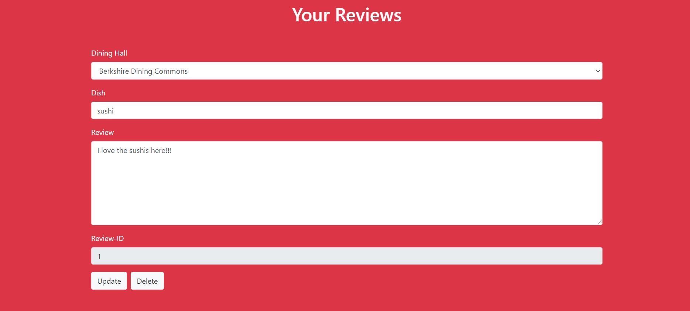

## Team Alpha

## ZooMass Dine-In

## Fall 2020

# Overview

Link: https://cs326-final-alpha.herokuapp.com/

Our website is a dining hall review page, that allows students to login and leave a review, and also be able to read reviews from other students. They leave review on dishes found at the UMass Dining Halls (4 dining halls, as well as Blue Wall).

There already exists a UMass Dining app, but it does not have a mechanism for student feedback. We thought that this website would potentially be useful to new and old students alike, to select better food at Dining Halls. It could also be used to measure Dining Hall Performance.

# Team Members

Govind Chandak - itsGovindC \
Pari Yogesh - pariyogesh

# User Interface

- Login  
    Page used for logging in students who already have accounts. Redirects to Index Page once logged in. \
    
- Register \
    Page used for creating accounts for students who don't have accounts. Redirects to Login Page once registered. \
    
- Index Page \
    Page that contains the options to redirect to all pages on website except login/register. Users are redirected to this page if they already logged in when typing the website address. Serves as the main hub for this website. \
    
- Leave a Review
    Page used to leave reviews. Contains fields that are required for reviews to be displayed. Users have to enter Dining Hall, Dish and their review. \
    
- View your reviews
    Page used to view your reviews. Shows the user reviews which includes Dining Hall, Dish, Review and Review ID. We can update/delete the reviews left by the users on this page \
    
- Read User Reviews
    The main page for viewing all user reviews, from all the users on this website. No buttons for interactivity, as the page is purely meant for reading purposes \
    

# API 

All of our APIs return a JSON object, which is an array of identical objects.

- /createReview - sends a JSON Object through POST, where the JSON object has the fields dining, dish and review. This is stored in the database along with the user, and given a unique review ID

- /readReviews - Returns all user reviews to client, as an array of JSON Objects, where each object has fields for username, review, dish, and the dining hall as an integer (unique integer corresponding to each dining hall). (Also has a field for review ID, but not needed to display)

- /viewUserReview - Returns reviews corresponding to the currently logged in user on the client, in the form of an array of JSON objects, where each object has fields for review, dish, dining hall (as integer). Also contains username object, but same for each object, so we dont display it.

- /updateReview - Used to send an object to the client, containing review id, dish, dining hall and updated review, and server updates review based on review id
- /deleteReview - Used to send an object just containing id of the review to  be deleted. No other fields required to delete a review.

# Database

username database
| Column       | Data Type | Description              |
|--------------|-----------|--------------------------|
| username     | text      | stores the username      |
| salt         | text      | returned by minicrypt    |
| hash         | text      | returned by minicrypt    |

reviewpage database
| Column       | Data Type | Description              |
|--------------|-----------|--------------------------|
| username     | text      | stores the username      |
| id           | serial    | unique id for the review which auto increments when you add new review    |
| dining       | int       | stores any of five numbers that correspond to the 5 dining halls at UMass |
| dish         | text      | stores the dish reviewed |
| review       | text      | description of the food reviewed |

The username is the same in both databases, i.e. foreign keys. ID's for reviewpage are unique integers that are auto-incremented upon addition of reviews, which is why we decided to use SERIAL.

# URL Routes/Mapping

- / - used to serve the index.html page, but user needs to be authenticated. 

- /login - default page that all pages redirect to if user is not authenticated. Serves the login.html page

- /register - used to register users, and serves the register.html page. 

- /leaveReview - used to leave a review, and serves the leaveReview.html page. Only logged in users can access. 

- /viewReview - used to view all the reviews for the website. Only logged in users can access. Serves the viewReview.html page.

- /viewUserReview - used to view all the user specific reviews, serves the viewUserReview.html page, and only logged in users can access this.

- /logout - logs out the users, and regardless of being logged in prior to accessing the website, redirects to the login page

# Authentication/Authorization

Users are authenticated when they first arrive to the website, since all the other pages (except register) require the user to be logged in. We used passport-js to verify the user, and verify this on the server side by comparing the password to the salt and hash stored in our database. For this we take advantage of minicrypt.js

Authenticated users can access the leaveReview, viewUserReview, viewReview pages. Other users can only access login/register and logout page.

# Division of Labor

- Pari Yogesh 
    - Milestone 1: Responsible for wireframe design , designed the leave a review page and the login page. Essentially did the input pages. 
    - Milestone 2 : Added a new HTML Page, that shows all the user reviews, worked on the initial database.js, which returns fake data right now. Also created the viewUserReview.js, which handles all the front-end functionality for update and delete functions. viewUserReview.js was a major contribution, and is roughly equal to all the other js code in the client.
    - Milestone 3: the initial set up of the username database, did 50% of the work for the passport functions, did the implementation of the hashing functions
- Govind Chandak
    - Milestone 1: Responsible for writing the markup document. Setup the files and did 2 of the html pages, login and seeReview. Worked on the output  pages.
    - Milestone 2: fixed HTML and routing issues with express js, added some functionality to database.js later. Created the shorter 3 files viewReview.js, leaveReview.js. Deployed to heroku and linted the code. Did the final bug fixes. Lastly, wrote most of the code for server.js
    - Milestone 3 : bug fixed implementations, finished the passport functions and set up all functions required for the review page database and did the deployment

# Conclusion

We learnt the importance of planning ahead, especially with things such as endpoints in your server i.e. defining an API in advance, and also learnt a lot about the usefulness of bootstrap.

For me, Govind Chandak, I found the front-end design to be difficult, as I had to find a way to create event listeners that had to have different scopes when referring to a global variable. This was perhaps the most difficult part of the project for me. I enjoyed coding in express however.

For me, Pari Yogesh, I also found front-end hard, as I had to create parametrized HTML in javascript for returning all the reviews in a bootstrap format (in order to avoid creating a lot of small java objects). The part I enjoyed the most about the project was SQL and learning about bootsrap. Database and HTML design are much easier to work with/create.

As a team, we would have like to known express (especially) when we began working on this project, as it allowed us to create a lot of endpoints easily, and would have allowed us to plan better, and create more routes that allow for filter functionality on our viewReview page.

