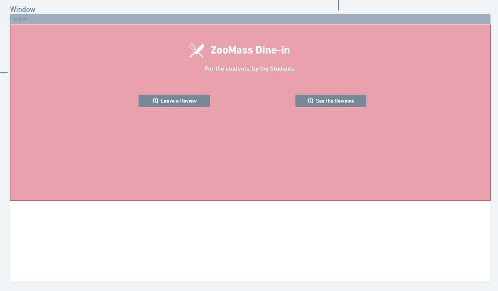
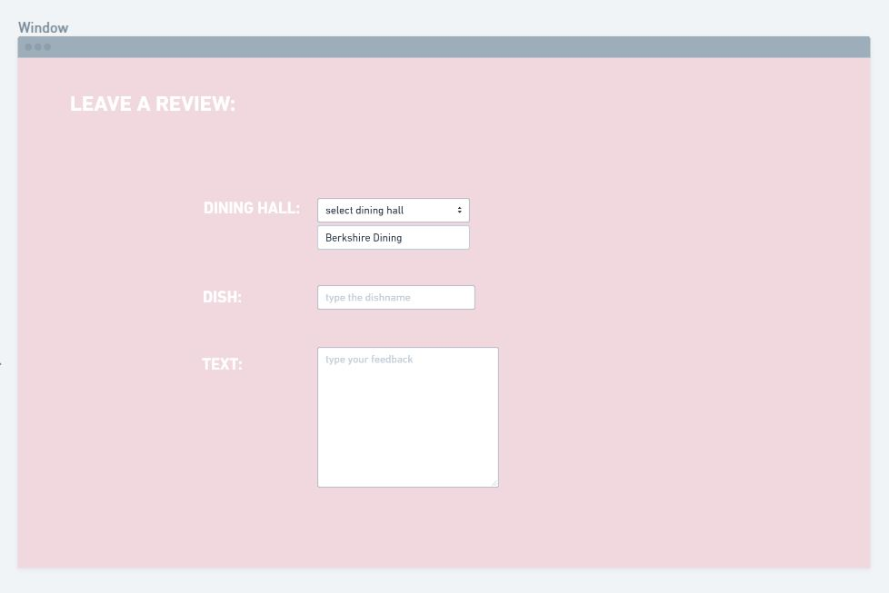
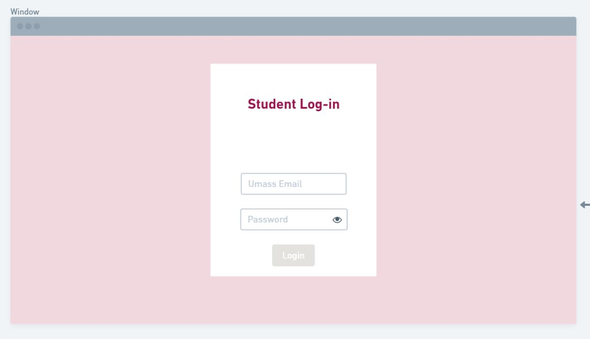
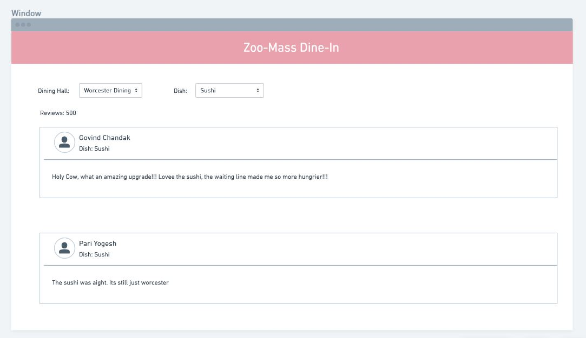

In our project, the data interactions will be mainly in the form of reviews.

We will be storing user reviews, where users will be allowed to select a dish, dining hall, assign a a text review. These will be associated with the user's ID and password, since they can only access the review page after they have logged in.

From our landing page, users can go to either a "Leave a Review page", which is preceded by a login page. 

On the leave a review page,  users can enter their reviews. We require the users to enter a dining hall and dish, as well as text review. We will also try to incorporate numeric ratings.

Before this however, we will require them to enter their login, which will either create an account for them (if signup page), or validate them.

On the view a review page, we can sort out the reviews based on dining halls first, then specific dishes. We will try to incorporate functionality that allows users to select whatever is being served without having to manually type all the dishes ourselves.

Contributions to this milestone

Pari Yogesh - Responsible for wireframe design , I designed the leave a review page and the login page. Essentially did the input pages. 

Govind Chandak - Responsible for writing the markup document. Setup the files and did 2 of the html pages, login and seeReview. Worked on the output  pages.