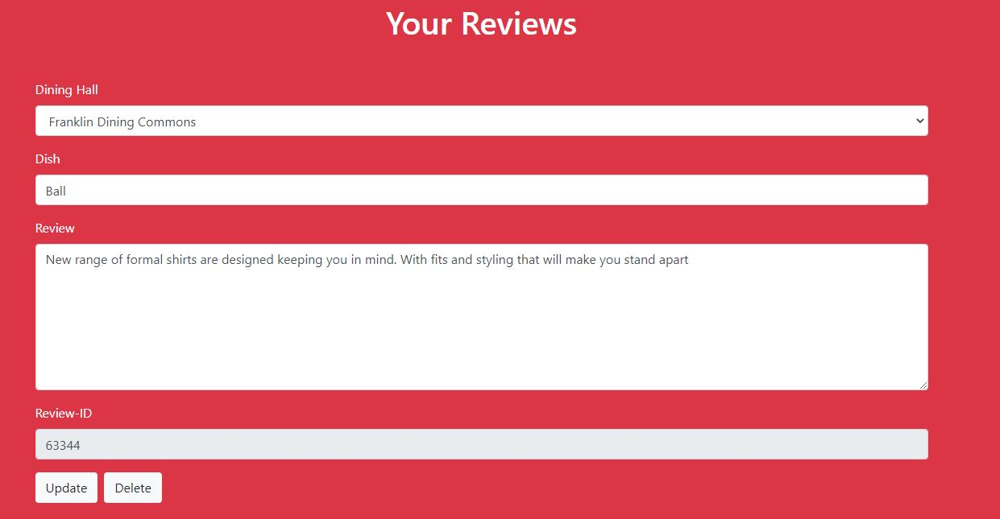
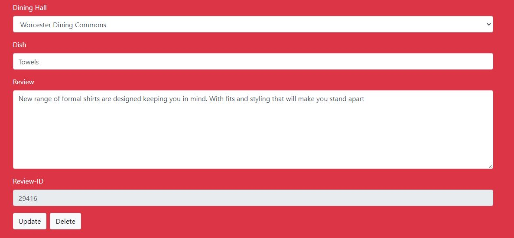
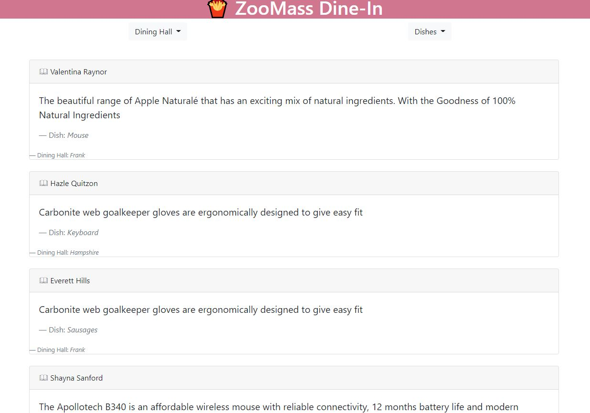

In our application, we have defined one endpoint corresponding to each of the CRUD operations.
For our '/readReviews', If a user is specified, we can retrieve all data relevant corresponding to that user,  otherwise we return all the reviews. When we have our databases setup, we will extend this functionality to allow us to sort data by dining hall/and dishes.

For '/createReview', the endpoint requires that the data contain all the parameters, such as username,dining, dish and the review itself.
For '/updateReview', the endpoint requires the updated data, and updates the database based on the review_id.
For '/deleteReview', the endpoint requires the review_id, in order to delete that particular review in our database.

We have used fake data, which is why the reviews are non-sensical. For now, update just creates a message on the server, but doesn't call any database function. The same thing applies to delete.

URL : https://cs326-final-alpha.herokuapp.com/

Contributions:

Pari Yogesh: Added a new HTML Page, that shows all the user reviews, worked on the initial database.js, which returns fake data right now. Also created the viewUserReview.js, which handles all the front-end functionality for update and delete functions. viewUserReview.js was a major contribution, and is roughly equal to all the other js code in the client

Govind Chandak: fixed HTML and routing issues with express js, added some functionality to database.js later. Created the shorter 3 files viewReview.js, leaveReview.js. Deployed to heroku and linted the code. Did the final bug fixes. Lastly, wrote most of the code for server.js